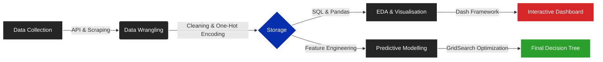
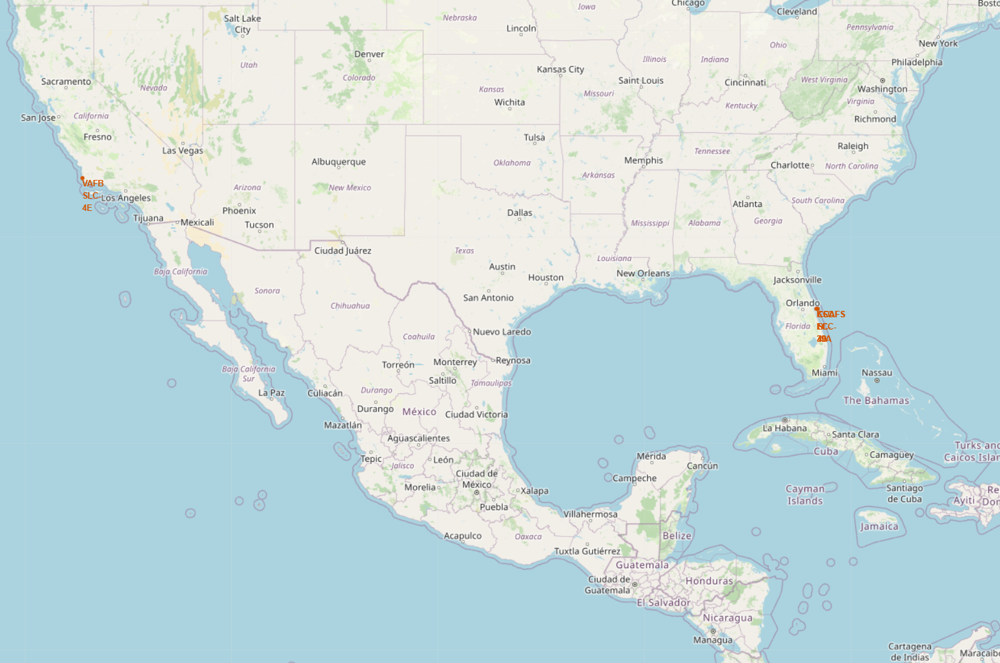
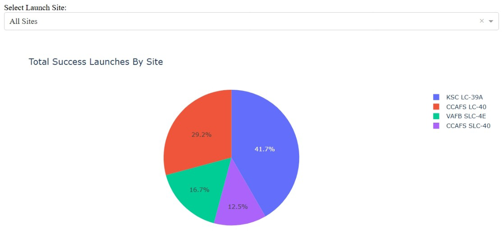
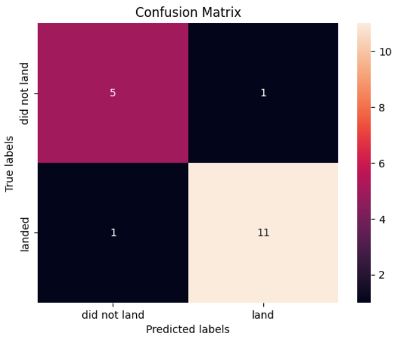

# Space Y: Commercial Rocket Launch Cost Optimisation Strategy


> **A predictive machine learning pipeline designed to compete with SpaceX by algorithmically estimating first-stage booster landing success probabilities.**

---

## Executive Summary

The commercial aerospace sector has been disrupted by SpaceX's Falcon 9 reusable rocket architecture, which has drastically reduced the cost of orbital access. **Space Y**, a new challenger in the market, aims to replicate this cost-saving model.

This repository contains the end-to-end data science architecture developed to answer a critical strategic question: **"Can we predict if a rocket will land successfully before it even launches?"**

By scraping 90+ historical launch records, auditing orbital physics, and training multi-class classification models, this project delivers a decision-support engine that allows Space Y to:
1.  **Optimise Bidding:** Identify "safe" contracts (high probability of recovery) to undercut competitors.
2.  **Mitigate Risk:** Quantify failure probabilities for high-risk missions (GTO/Heavy Payload).
3.  **Visualise Operations:** Deploy an interactive dashboard for real-time telemetry analysis.

---

## IBM Data Science Professional Certificate

This project serves as the **Capstone Submission** for the [IBM Data Science Professional Certificate](https://www.coursera.org/professional-certificates/ibm-data-science). It represents the culmination of 12 courses covering Data Engineering, SQL, Visualisation, and Machine Learning.

📄 **Certificate Verification:** [IBM Data Science Professional Certificate.pdf](IBM%20Data%20Science%20Professional%20Certificate.pdf)

---

## Key Results at a Glance

* **Predictive Accuracy:** The optimised **Decision Tree Classifier** achieved a validation accuracy of **87.5%** and a Precision Score of **91.6%** for successful landings.
* **Strategic "Green Zone":** Analysis identified that payloads between **2,000kg – 6,000kg** launched to **LEO/SSO** have the highest statistical recovery rate (>90%).
* **Risk Quantification:** Heavy payloads (>10,000kg) to Geostationary Transfer Orbit (GTO) represent "Expendable Class" risks, requiring a **20% insurance premium**.

---

## System Architecture

The project follows a linear Data Science lifecycle, structured into four distinct phases.



---

## Repository Structure

The repository is organised to reflect the chronological flow of the project.

```text
├── data/                        # Raw & Processed Datasets
│   ├── dataset_part_1.csv       # API Extraction Output
│   ├── dataset_part_2.csv       # Wrangled Dataset (Class Labels added)
│   ├── my_data1.db              # SQLite Database for SQL Analysis
│   └── spacex_launch_dash.csv   # Dashboard-optimised Dataset
│
├── images/                      # Visual Assets
│   ├── backgrounds/             # Presentation Assets (Dark Mode)
│   ├── flowcharts/              # Exported Pipeline Diagrams
│   └── screenshots/             # Results & Dashboard Evidence
│
├── mermaid/                     # Diagram Source Code
│   ├── data_collection.mmd      # Source logic for flowcharts
│   └── ...
│
├── notebooks/                   # Jupyter Notebooks (Numbered by Execution Order)
│   ├── 01_Data_Collection_API.ipynb
│   ├── 02_Data_Collection_WebScraping.ipynb
│   ├── 03_Data_Wrangling.ipynb
│   ├── 04_EDA_SQL.ipynb
│   ├── 05_EDA_Dataviz.ipynb
│   ├── 06_Launch_Site_Location.ipynb
│   ├── 07_SpaceX_Dash_App.py    # Plotly Dash Application Script
│   └── 08_Machine_Learning_Prediction.ipynb
│
├── Capstone Presentation.pdf    # Final Strategic Report
├── IBM Data Science Professional Certificate.pdf
└── README.md                    # Project Documentation
```

---

## Data Dictionary

Key variables used in the predictive analysis:

| Variable | Description |
| :--- | :--- |
| **Class** | **0** = Failure (Crash/Ocean) \| **1** = Success (Ground Pad/Drone Ship) |
| **Payload Mass** | The total mass of the satellite/cargo in kg. |
| **Orbit** | Target destination (e.g., **LEO** = Low Earth Orbit, **GTO** = Geostationary Transfer). |
| **Launch Site** | **CCAFS** (Cape Canaveral), **KSC** (Kennedy Space Center), **VAFB** (Vandenberg). |
| **Flights** | Number of times the specific booster core has been reused. |

---

## Methodology

The project was executed in four analytical phases, corresponding to the numbered notebooks in the repository.

### Phase 1: Data Engineering (Notebooks 01-03)
**Objective:** Construct a robust dataset from disparate sources.
* **API Extraction:** Utilised custom wrapper functions to pull launch data from the **SpaceX REST API (r4.0)**, filtering for Falcon 9 launches.
* **Web Scraping:** Built a `BeautifulSoup` scraper to extract historical launch records from Wikipedia to supplement API gaps.
* **Wrangling:** Standardised the dataset, handling missing values in `PayloadMass` and calculating `Class` labels (1=Success, 0=Failure).

### Phase 2: Exploratory Data Analysis (Notebooks 04-06)
**Objective:** Uncover patterns and geospatial relationships.
* **SQL Analytics:** Executed SQL queries against the `my_data1.db` database to calculate failure rates across different timeframes and landing sites.
* **Geospatial Mapping:** Used `Folium` to map launch sites and calculate proximity to critical infrastructure (Railways, Coastlines).


> *Visualisation of the four primary launch sites and their coastal proximity.*

### Phase 3: Interactive Visualisation (Notebook 07)
**Objective:** Develop a user-friendly tool for real-time risk assessment.
* **Tech Stack:** Built a `Plotly Dash` application with modular logic functions to decouple UI from data processing.
* **Features:**
    * Dynamic Payload Range Slider (0kg - 10,000kg).
    * Launch Site Dropdown (All Sites vs Specific).
    * Success/Failure Pie Charts & Scatter Plots.


> *Interactive Dashboard showing global success rates.*

### Phase 4: Predictive Machine Learning (Notebook 08)
**Objective:** Build and optimise a classification model.
* **Preprocessing:** Applied One-Hot Encoding to categorical variables (Orbit, Launch Site) and standardised numerical features.
* **Model Tournament:** Trained and evaluated four algorithms using `GridSearchCV` (10-fold Cross-Validation):
    1.  Logistic Regression
    2.  Support Vector Machine (SVM)
    3.  Decision Tree Classifier
    4.  K-Nearest Neighbors (KNN)
* **Result:** The **Decision Tree** outperformed all models with **87.5% Accuracy** on the validation set.


> *Confusion Matrix for the optimised Decision Tree model, showing distinct separation between successful and failed landings.*

---

## Getting Started

### Prerequisites
The project requires **Python 3.9+** and the following libraries:
* `pandas`, `numpy`, `matplotlib`, `seaborn`
* `scikit-learn`
* `folium`
* `dash`, `plotly`
* `beautifulsoup4`

### Installation
1. **Clone the repository:**
   ```bash
   git clone https://github.com/nshah1d/IBM-DS-Capstone.git
   cd IBM-DS-Capstone
   ```
2. **Install dependencies:**
   ```bash
   pip install pandas numpy matplotlib seaborn scikit-learn folium dash plotly beautifulsoup4
   ```

### Running the Analysis
The notebooks are numbered to be executed in sequential order.

1. Navigate to the `notebooks/` directory.
2. Launch Jupyter Lab or Notebook:
   ```bash
   jupyter lab
   ```
3. Run notebooks `01` through `08` in order.

### Running the Dashboard
To launch the interactive analytics dashboard:

1. Navigate to the notebooks directory:
   ```bash
   cd notebooks
   ```
2. Execute the Python script:
   ```bash
   python 07_SpaceX_Dash_App.py
   ```
3. Open your browser and navigate to the local server address shown in the terminal (usually `http://127.0.0.1:8050/`).

---

## Strategic Insights

Based on the analysis of 90+ launches, the following data-driven strategies are recommended for **Space Y**:

1.  **Operational Hub:** Establish **KSC LC-39A** as the primary launch facility. It boasts the highest success rate (>76%) and supports the widest range of orbital inclinations.
2.  **Payload Targeting:** Aggressively bid on **LEO/SSO** satellite contracts in the **2,000kg – 6,000kg** range. This mass class aligns with the highest landing success probability, minimizing insurance premiums.
3.  **Risk Management:** Apply a **20% risk premium** to any contract involving **GTO** orbits or payloads exceeding **10,000kg**, as these profiles statistically correlate with lower recovery rates.

---

<div align="center">
<br>

**_Architected by Nauman Shahid_**

<br>

[](https://www.nauman.cc)
[](https://github.com/nshah1d)
[](https://www.linkedin.com/in/nshah1d/)

</div>
<br>

---

Licensed under the [MIT License](LICENSE).
Data Source: SpaceX REST API (r4.0) & Wikipedia.